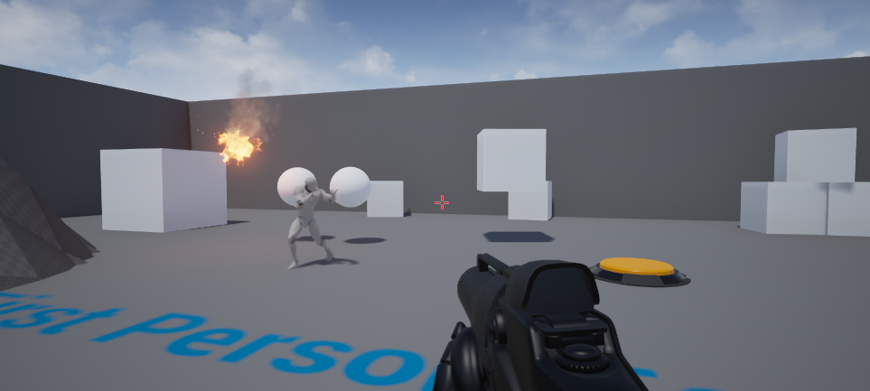

# UnrealCV playground

The UnrealCV playground is a minimal UE4 project to demonstrate the usage of UnrealCV. It is also used in the development of UnrealCV, especially for debugging and testing.

This UE4 project is carefully modified from FirstPerson shooter template of UE4. The template is modified to reduce size and add more UE4 features for testing. This is a screenshot of what this project looks like

This project is still under construction. Its documentation is hosted in [docs.unrealcv.org](docs.unrealcv.org).

## Feedback

Issue for this project can be reported to the issue tracker of either [unrealcv](github.com/unrealcv/unrealcv) or [playground](github.com/unrealcv/playground).
